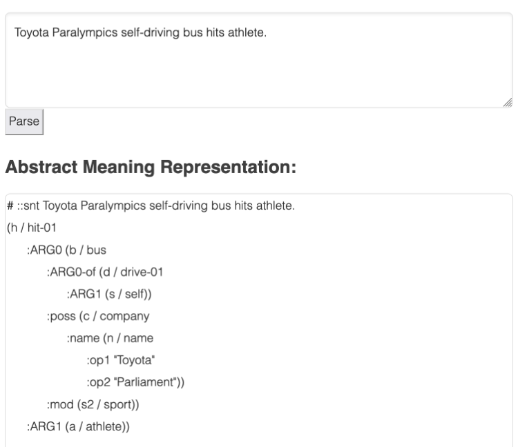

# incidentamr-server

A server to test parsing text to Abstract Meaning Representation. All of these are for experimentation purpose. I would like to develop a small meaning representation corpus for incident report in the future.

- Use [AMRLib](https://github.com/bjascob/amrlib) for AMR parsing, with a Sentence to Graph model from [amrlib-models](https://github.com/bjascob/amrlib-models)  (AMR is a graph, rather than a tree)
- Use [Uvicorn](https://www.uvicorn.org/) and [FastAPI](https://fastapi.tiangolo.com/) for web server and API framework

## Install

1.  Download source
    ```sh
    git clone https://github.com/bact/incidentamr-server.git
    ```
2.  Install required libraries
    ```sh
    cd incidentamr-server
    pip install -r requirements.txt
    ```
3.  Install a model
    - Download any *Sentence to Graph* model from [amrlib-models/releases](https://github.com/bjascob/amrlib-models/releases).
        - For example,  `model_parse_xfm_bart_large-v0_1_0.tar.gz`.
    - Extract the tar.gz file, you will get a directory containing .json and .bin files. Rename that directory to `stog`.
    - Put the `stog` directory inside `incidentamr-server/incidentamr_server/models` directory.


## Run

1. Start the server. From inside `incidentamr_server` directory, run:

   ```sh
   uvicorn main:app --reload
   ```
2. Then, from within a web browser, open [http://127.0.0.1:8000](http://127.0.0.1:8000).
   
   The web interface will look like this:

   


## Meaning Representations

The main paper for Abstract Meaning Representatio (AMR) is

- Banarescu, Laura, Claire Bonial, Shu Cai, Madalina Georgescu, Kira Griffitt, Ulf Hermjakob, Kevin Knight, Philipp Koehn, Martha Palmer, and Nathan Schneider. 2013. **‘Abstract Meaning Representation for Sembanking’**. In Proceedings of the 7th Linguistic Annotation Workshop and Interoperability with Discourse, 9. Sofia, Bulgaria: Association for Computational Linguistics. https://aclanthology.org/W13-2322.pdf.

More information about AMR can be found at [AMR Bank](https://amr.isi.edu/) website.

Another interesting development is Uniform Meaning Representation (UMR). Their main paper is

- Van Gysel, Jens E. L., Meagan Vigus, Jayeol Chun, Kenneth Lai, Sarah Moeller, Jiarui Yao, Tim O’Gorman, et al. 2021. **‘Designing a Uniform Meaning Representation for Natural Language Processing’**. KI - Künstliche Intelligenz 35 (3): 343–60. https://doi.org/10.1007/s13218-021-00722-w.

More information about UMR can be found at [UMR Project](https://umr4nlp.github.io/web/).

*U in UMR in this meaning representation area can be many things: Unified, Uniform, Universal, etc.
